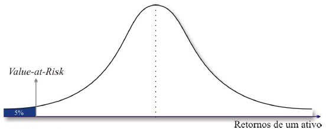

```{r setup, include=FALSE}
knitr::opts_chunk$set(echo = FALSE)
```

# Motivação

## Introdução

- De acordo com os princípios do acordo de Basileia III, as instituições financeiras supervisionadas pelos Bancos Centrais devem manter *buffers* de capital contra riscos de mercado, crédito, liquidez, entre outros.

- Para riscos de mercado, as duas formas mais usuais de fazer a quantificação destes são os métodos de Valor em Risco - VaR e o *Expected Shortfall* - ES.

- Uma estimação excessiva da medida de risco gerará um excesso de capital em reserva. Custo para a instituição.

- Uma subestimação deste risco pode levar a IF a uma crise de liquidez e eventualmente a insolvência.

## Valor em Risco

- VaR é um quantil $\alpha$ da distribuição de perdas de um ativo ou portfólio em um determinado período de tempo.

- O método VaR para cálculo de risco de mercado ao qual um portfólio está sujeito foi primeiramente introduzido pelo banco J. P. Morgan em 1995.

- Método original assumia distribuição normal das perdas, correlação constante entre ativos e era calculada de forma incondicional.

## Valor em Risco




# Fundamentação Teórica

## Slide with Bullets

- Bullet 1
- Bullet 2
- Bullet 3

# Modelo

## Slide with R Output

```{r cars, echo = TRUE}
summary(cars)
```

## Slide with Plot

```{r pressure}
plot(pressure)
```

# Resultados

# Referências


