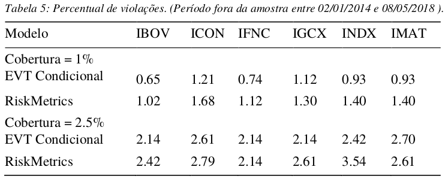
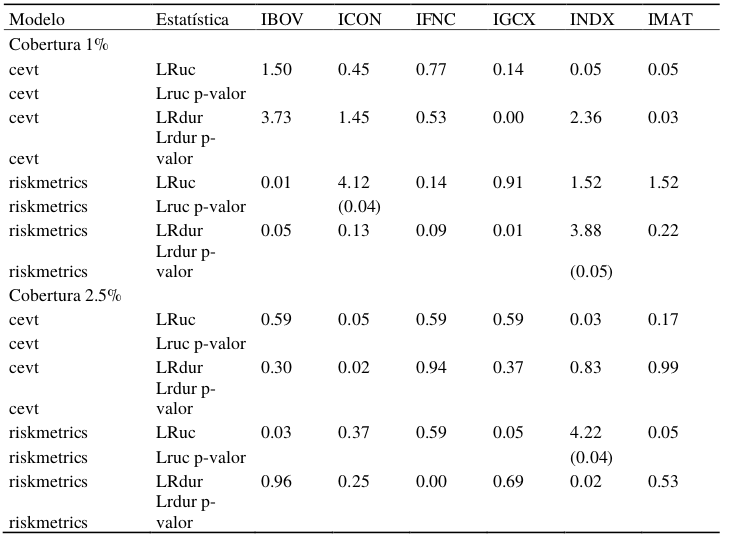

```{css, echo=FALSE}
.title-slide hgroup h1 {
  font-size: 52px;
  letter-spacing: 0;
}
```

```{r setup, include = FALSE}
knitr::opts_chunk$set(echo = FALSE)
knitr::opts_chunk$set(fig.width = 8.1)
knitr::opts_chunk$set(fig.height = 5.8)
knitr::opts_chunk$set(fig.align = 'center')

library(tidyverse)
library(ggthemes)
```

## Agenda {.build}

- Situação Problema
- Valor em Risco - VaR
- Teoria do Valor Extremo - EVT
- Modelo GARCH
- Índices Utilizados
- Resultados

# Introdução

## Situação Problema 

- Princípios de Basileia 
- Instituições Financeiras devem manter reservas de capital contra riscos de mercado, crédito, liquidez, entre outros
- Estimação excessiva do risco gera excesso de capital em reserva. Custo para a instituição.
- Subestimação deste risco pode levar a IF a uma crise de liquidez e eventualmente a insolvência.
- Risco de mercado medio por Valor em Risco - VaR

## Objetivo

- Avaliar dois modelos de estimação de VaR
- Índices setoriais Bovespa
    + Financeiro (IFNC)
    + Consumo (ICON)
    + Industrial (INDX)
    + Materiais (IMAT)
    + Governança (IGCX) 
    + IBovespa (IBOV)
- Avaliação do modelo mais adequado através de dois testes estatísticos
    + Cobertura incondicional
    + Independência das violações

## Valor em Risco | definição

- VaR é uma medida de risco de mercado do portfolio
- Maior valor de perda esperado para um determinado período e dado nível de confiança
- VaR é um quantil $\alpha$ da distribuição de perdas que delimita a cauda.

## VaR | distribuição de perdas

```{r var}
# fig.cap = "VaR é um quantil da distribuição de perdas."
# fig.cap = "ES é o valor esperado das perdas, dado que a perda exceda o VaR."
x <- seq(-3, 3, by = 0.05)
y <- dnorm(x)
df <- data.frame(x, y)
p <- ggplot(df, aes(x, y)) + 
  geom_area(data = subset(df, x > 1.2), fill = "tomato") +
  #geom_area(data = subset(df, x < -1.96), fill = "red") +
  #geom_area(data = subset(df, x > 1), fill = "lightgreen") +
  #geom_area(data = subset(df, x > 1.96), fill = "green") +
  geom_line() +
  labs(title = "Perdas", x = "", y = "") +
  # geom_segment(aes(x = 1.2, y = 0, xend = 1.2, yend = dnorm(1.2))) +
  # geom_segment(aes(x = 2, y = 0, xend = 2, yend = dnorm(2))) +
  geom_segment(aes(x = 1.2, y = 0, xend = 1.2, yend = 0.4)) +
  geom_segment(aes(x = 2, y = 0, xend = 2, yend = 0.4), linetype = "dotted") +
  theme_economist_white()

p + annotate("text", x = c(1.5, 1.6, 2.3), y = c(0.35, 0.03, 0.35), 
           label = c("VaR[alpha]", "1 - alpha", "ES[alpha]"), parse = TRUE, size = 6)
```

# Fundamentação Teórica

## Teoria do valor extremo | fundamentos {.build}

- EVT é um ramo da estatística que trata de eventos raros, distantes da mediana
- Aplicações em hidrologia, geologia, seguros e finanças, entre outros
- Distribuições de probabilidade com caudas longas
- É adequada aos fatos estilizados dos retornos financeiros
    + Curtose em excesso
    + Assimetria nos retornos
    + Heterocedasticidade condicional

## Teoria do valor extremo | definições 

- Existem duas abordagens para a EVT
    + Máximos em bloco - $M_n$
    + Peaks-over-threshold - POT
  
- POT é a mais utilizada na prática
- Desperdiça um menor número de observações

```{r defi_gev, child='gev.Rmd', eval = params$extended}
```

## Teoria do valor extremo | definições {.build}

```{r pot_plot}
set.seed(123)
n <- 1:20
loss <- rnorm(length(n), 0, 0.05)
u <- rep(median(sqrt(loss^2)), times = length(n))
df <- tibble(n, loss, u)
ggplot(df, aes(x = n, y = loss)) +
  geom_segment(aes(y = 0, yend = loss, xend = n), size = 2) +
  geom_hline(aes(yintercept = u[1]), color = "darkgreen") +
  labs(title = "Peaks-over-threshold",
       x = "",
       y = "Perda") +
  scale_y_continuous(label = scales::percent) +
  scale_x_discrete(breaks = n) +
  annotate("segment", x = 16, xend = 16, y = u[1], yend = loss[16],
           color = "red") +
  annotate("text", x = c(0.1, 17), y = c(0.032, 0.07), label = c("Limiar", "Excesso")) +
  theme_economist_white()
```

```{r defi_gpd, child='defi_gpd.Rmd', eval = params$extended}
```

```{r gpd_ic, child='gpd_ic.Rmd', eval = !params$extended}
```

## Teoria do valor extremo | peaks-over-threshold

- Como se deve escolher o valor **adequado** do limiar?
    + Gráficos de vida residual média (função média dos excessos _versus_ _u_)
    + Escolher o menor valor de _u_ onde a relação é linear
    + Na prática, número de excessos observados em torno de 100 

- _Trade-off_ entre limiar alto e número de excessos
    + Limiar muito baixo, teorema PBH não é satisfeito
    + Limiar muito alto, poucos excessos e alta variância nos parâmetros $\xi$ e $\psi$

# Modelo

## Modelo EVT Condicional | dois estágios{.smaller .build}

- Seguiu-se os passos propostos por @McNeil2000
- Estimação feita em dois passos
    + Filtragem GARCH
        - Modelo GARCH(1, 1) de @Bollerslev1986 para retirar heterocedasticidade
        - Resíduos padronizados podem ser tratados como _iid_
    + Aplicação da EVT aos resíduos padronizados
- Modelo completo para a medida de risco $VaR_\alpha$ condicional

$$
\begin{align*}
\mu_t=\;&\mu+ \phi_1 \mu_{t-1}+ \varepsilon_t \\
\varepsilon_t=\;&\sigma_t Z_t\\
\sigma_t^2=\;&\omega+ \alpha_1 \varepsilon_{t-1}^2+ \beta_1 \sigma_{t-1}^2 \\
Z_t\sim \;&\mathcal{D}(0,1) \text{ e } \mathcal{D} \in MDA(H_\xi)
\end{align*}
$$

## VaR parametrizado {.smaller}

### EVT condicional {.box-12 .practical .outline}

$$
VaR_\alpha^t=\mu_{t+1}+\sigma_{t+1}z_\alpha
$$

- $z_\alpha$ é o quantil $\alpha$ das inovações *Z* obtido pela EVT

$$
z_\alpha=q_\alpha(F_z) = u+\frac{\psi}{\xi}\left[ \left( \frac{1-\alpha}{\bar{F_z}(u)}\right)^{-\xi}-1 \right]
$$

### Riskmetrics {.box-12 .practical .outline}

$$
\begin{align}
	\mu_t=\;& \varepsilon_t\\
	\varepsilon_t=\;& \sigma_tZ_t\\
	\sigma^2_t=\;& (1-\lambda)\varepsilon^2_{t-1}+\lambda \sigma^2_{t-1}\\
	VaR_\alpha^t=\;& \sigma_{t+1}\Phi^{-1}(\alpha)
\end{align}
$$

# Dados utilizados

## Seis índices de ações | segmentos da Bovespa

- Seis principais índices setoriais de
ações da Bovespa, por valor de mercado
    + Financeiro (IFNC)
    + Consumo (ICON)
    + Industrial (INDX)
    + Materiais (IMAT)
    + Governança (IGCX) 
    + e o próprio índice Bovespa (IBOV)
    
- Retornos diários
    + Período dentro da amostra: 01/01/2009 a 31/12/2013
    + Período fora da amostra: 01/01/2014 a 08/05/2018

## Estatísticas descritivas | retornos não são normais


```{r qqplots, child='qqplots.Rmd', eval = params$extended}
```

## Descritivas pós filtragem | sem autocorrelação na variância


# Resultados

```{r pot, child='pot.Rmd', eval = params$extended}
```

## Gráficos dos modelos | EVT _vs_ Riskmetrics


## Violações | quando a perda é maior que o VaR {.build}

- Violações ocorrem quando $\mu_{t+1} > VaR_\alpha^t$
- Modelo bem especificado
    + percentual de violações igual a $1-\alpha$
    + violações são independentes entre si
  
- $1 - \alpha$ é a cobertura incondicional

## Sumário de violações



## Teste fora da amostra | _backtest_

- Período vai de 01/01/2014 a 08/05/2018
- Avaliação dos modelos através de dois testes estatístios
- Cobertura incondicional de @Kupiec1995
- Independência entre violações de @Christoffersen2004

## Testes Estatísticos | cobertura incondicional e independência {.build .smaller}

### Teste de Kupiec de cobertura incondicional {.box-12 .outline .practical}

- Inferir se a frequência de violações ao VaR é
consistente com o nível de cobertura
- H0: modelo corretamente especificado
- Sob H0, a estatística $LR_{uc}$ segue uma distribuição $\chi^2_1$

### Teste de Christoffersen \& Pelletier de independência {.box-12 .outline .practical}

- Inferir se as violações não formam agrupamentos previsíveis
- H0: modelo corretamente especificado
- Única distribuição **sem** memória, exponencial
    + Weibull é caso particular
    + Teste sobre o parâmetro que se igual a 1 se torna exponencial

```{r testes, child='testes.Rmd', eval = params$extended}
```

## Sumário de rejeições de modelo bem especificado


- Número de rejeições possíveis igual a 6
- Modelo riskmetrics apresentou rejeição de modelo bem especificado para algum índice

# Muito Obrigado!

## Perguntas e Respostas | tabela completa de testes



<!-- ## Perguntas e Respostas | plot vida residual média -->

```{r mrl_plot_setup, echo=FALSE, include=FALSE}
library(xts)
library(PerformanceAnalytics)
library(rugarch)
library(evir)

start <- as.Date("2009-01-01")
end <- as.Date("2013-12-31")

######### Leitura do arquivo setoriais.csv
setor_df <- read_csv("../input/setoriais.csv")
setor_xts <- xts(setor_df[, -1], order.by = setor_df$Data) %>% 
  Return.calculate(method = "log") %>% 
  na.omit()
setor_xts <- setor_xts[paste0(start, "/")]
assets <- colnames(setor_xts) # Simbolos dos indices
last <- index(last(setor_xts)) # Ultima data na amostra
lista <- vector(mode = "list", length = length(assets))
for (i in seq_along(assets)) {
  lista[[i]] <- setor_xts[, i]
}
names(lista) <- assets
assets.tbl <- enframe(lista) %>% 
  bind_cols(tibble(id_name = c("Bovespa", "Consumo", "Financeiro", 
                               "Governanca", "Materiais", "Industrial")))

colnames(assets.tbl) <- c("indice", "ts", "id_name")
# Qual o tamanho da janela in sample?
insample <-  enframe(map_dbl(lista, ~ndays(.x[paste0("/", end)])))
names(insample) <- c("indice", "insample")
# Remove a variavel lista e assets que agora sao desnecessarios
rm(lista)
```

```{r mrl_plot, include=FALSE}
# Modelo GARCH in Sample-----------------------------------------------------------
## Modelo GARCH(1,1) para a variancia condicional
## Modelo AR(1) para a eq da media
## LEMBRAR: ts contem os retornos e não as perdas!

# Uma especificacao para cada ativo
ruspec <- ugarchspec(mean.model = list(armaOrder = c(1,0)),
                     variance.model = list(model = "sGARCH", garchOrder = c(1,1)),
                     distribution.model = "norm")
garch.specs <- replicate(length(assets), ruspec)
names(garch.specs) <- assets
garch.specs <- enframe(garch.specs)
colnames(garch.specs) <- c("indice", "spec")
## Modelando as PERDAS!! parametro eh loss para a funcao ugarchfit
# Deixamos um numero outsample para fazer o backtesting. Diferente para cada ativo
# garch.models vai conter o modelo GARCH dentro da amostra. Apresentar os 
# parametros e seus erros padrao robustos
# Depois apresentar novamente estatisticas como JB, Q e Q^2 para os erros padronizados
garch.models <- assets.tbl[,1:3] %>% 
  inner_join(insample, by = "indice") %>% 
  inner_join(garch.specs, by = "indice") %>% 
  mutate(loss = map(ts, ~-.x),
         loss_in = map2(ts, insample, ~-.x[1:.y]),
         garch_fit = map2(spec, loss_in, ~ugarchfit(.x, 
                                                    .y,
                                                    solver = "hybrid")),
         ts = NULL)

testez <- coredata(residuals(garch.models$garch_fit[[5]], standardize = TRUE))
meplot(testez, type = "l")
# shape(testez, models = 10, start = 90, end = 150)
# ## Teste com o pacote evd
# teste_evd <- fpot(testez, quantile(testez, 0.95))
# fitted.values(teste_evd)
# std.errors(teste_evd)  # Iguais ao fExtremes e evir
# mrlplot(testez)
```

```{r pot2, child='pot.Rmd', eval = !params$extended}
```

```{r testes_ic, child='testes.Rmd', eval = !params$extended}
```

## Referências {.smaller}
